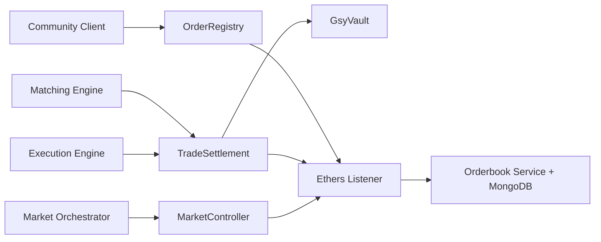

# GSY Decentralized Energy Exchange

## Introduction

The Grid Singularity Decentralized Energy Exchange (GSY DEX) provides a modular trading
platform for community energy markets.  
The system currently runs on an EVM-based architecture with:

- Smart contracts for market state, order lifecycle, settlement, and collateral.
- Off-chain services for indexing, matching, execution, orchestration, and APIs.
- End-to-end workflows validated through integration and BDD tests.

## What Changed in the Refactored System

The stack moved from a Substrate runtime approach to an EVM smart-contract-centered model.
The domain boundaries are preserved, but implementation responsibilities are now split between:

- On-chain contracts (`gsy-contracts`)
- Event listener and indexing (`gsy-ethers-listener`, `gsy-orderbook-service`)
- Off-chain matching and execution engines (`gsy-matching-engine`, `gsy-execution-engine`)
- Market scheduler and opening logic (`gsy-market-orchestrator`)
- Input publication and data bridging (`gsy-community-client`)

## System At a Glance

## Documentation Map

- **Platform Architecture**
  - Architecture and data flow.
  - Smart contracts and role model.
  - Orderbook, matching, execution, orchestrator, and community client internals.
- **Setup and Operations**
  - Installation prerequisites.
  - Build and run instructions.
  - Docker orchestration.
  - Test strategy and commands.
