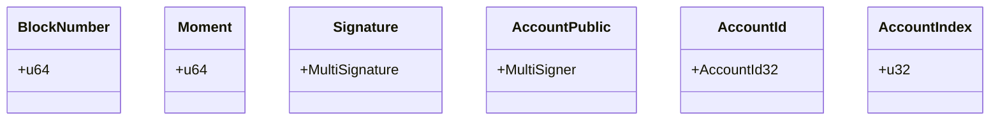
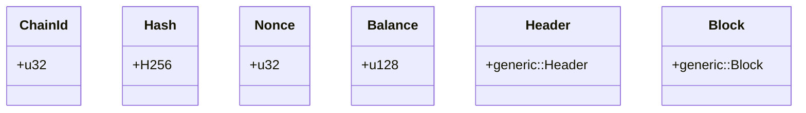
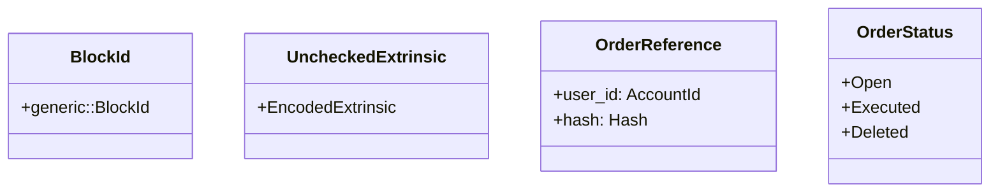

## GSy DEX Primitives

The above Rust code defines the core types used in the GSy-Decentralized Energy Exchange. It includes various primitive data structures such as types for block numbers, moments, signatures, public keys, account IDs, account indices, chain IDs, hashes, nonces, balances, headers, blocks, and extrinsics. Additionally, it exports the OrderReference and OrderStatus types from the `orders` module.

Here is an overview of the data structures defined in the code:

- `BlockNumber`: a type alias for a 64-bit unsigned integer used to represent block numbers in the GSy-Decentralized Energy Exchange.
- `Moment`: a type alias for a 64-bit unsigned integer used to represent an instant or duration in time.
- `Signature`: a type alias for the `MultiSignature` type from the `sp_runtime` module. This type is used to represent a signature for a transaction on the GSy chain. It allows one of several underlying cryptographic algorithms to be used, so it isn't a fixed size when encoded.
- `AccountPublic`: a type alias for the `Signer` associated type of the `Verify` trait implemented for `Signature`. This type represents the public key used for the GSy chain and is actually a `MultiSigner`. Like the signature, this type also isn't a fixed size when encoded, as different cryptographic algorithms have different size public keys.
- `AccountId`: a type alias for the `AccountId32` type associated with the `IdentifyAccount` trait implemented for `AccountPublic`. This type is an opaque account ID type for the GSy chain and is always 32 bytes.
- `AccountIndex`: a type alias for a 32-bit unsigned integer used to represent the type for looking up accounts.
- `ChainId`: a type alias for a 32-bit unsigned integer used to represent the identifier for a chain.
- `Hash`: a type alias for the `H256` type from the `sp_core` module. This type is used to represent a hash of some data used by the GSy chain.
- `Nonce`: a type alias for a 32-bit unsigned integer used to represent the index of a transaction in the relay chain.
- `Balance`: a type alias for a 128-bit unsigned integer used to represent the balance of an account on the GSy chain.
- `Header`: a type alias for the `generic::Header<BlockNumber, BlakeTwo256>` type from the `sp_runtime` module. This type represents the header of a block in the GSy-Decentralized Energy Exchange.
- `Block`: a type alias for the `generic::Block<Header, UncheckedExtrinsic>` type from the `sp_runtime` module. This type represents a block in the GSy-Decentralized Energy Exchange.
- `BlockId`: a type alias for the `generic::BlockId<Block>` type from the `sp_runtime` module. This type represents the ID of a block in the GSy-Decentralized Energy Exchange.
- `UncheckedExtrinsic`: an opaque, encoded, unchecked extrinsic that is used to represent a transaction on the GSy chain.
- `OrderReference`: a type defined in the `orders` module that represents a reference to an order in the GSy-Decentralized Energy Exchange.
- `OrderStatus`: a type defined in the `orders` module that represents the status of an order in the GSy-Decentralized Energy Exchange.
- `mod orders`: a module that exports the `OrderReference` and `OrderStatus` types.

### The `orders` Module

The `orders` module defines two types:

- `OrderStatus`: An enum that represents the status of an order in the GSy-Decentralized Energy Exchange. It has three variants:
    - `Open`: The default status.
    - `Executed`: The order has been executed.
    - `Deleted`: The order has been cancelled.
- `OrderReference`: A struct that represents a reference to an order in the GSy-Decentralized Energy Exchange. It has two fields:
    - `user_id`: The account ID of the user who created the order. 
    - `hash`: The hash of the order struct which represent a unique reference.

### Primitives Diagram

