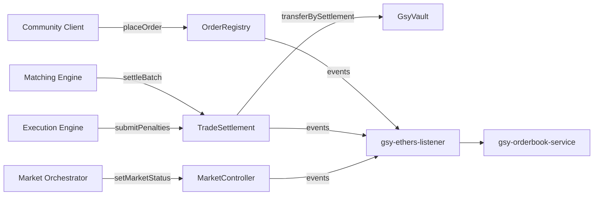

# GSY DEX Platform Overview

## Architecture Goal

The refactored GSY DEX architecture keeps business responsibilities split across services, while
moving blockchain logic to EVM smart contracts.  
This gives:

- Clear on-chain trust boundaries.
- Contract-enforced role-based permissions.
- Off-chain scalability for matching and execution cycles.

## Core Building Blocks

- **Anvil (EVM chain, chain id 31337)** for local and CI execution.
- **Smart contracts** (`MarketController`, `OrderRegistry`, `TradeSettlement`, `GsyVault`).
- **Event indexing layer** (`gsy-ethers-listener` + `gsy-orderbook-service`).
- **Business services** (orchestrator, matching engine, execution engine, community client).

## End-to-End Flow

## Runtime Interfaces

- **EVM WS endpoint**: `ws://anvil:8545` (inside compose network).
- **Orderbook API**: `http://gsy-orderbook:8080`.
- **Primary trigger model**:
  - Matching runs on block cadence.
  - Execution runs on periodic timeslot cycles.
  - Orchestrator runs time-window checks for market open/close.

## Reference Pages

- [System Components Overview](system-components-overview.md)
- [Smart Contracts](smart-contracts.md)
- [Off-Chain Storage](off-chain-storage.md)
